# S-DES

## 测试结果

### 第1关：基本测试

- 加密操作：

  1. 首先输入8bit明文：

     

  2. 随后生成随机密钥：

     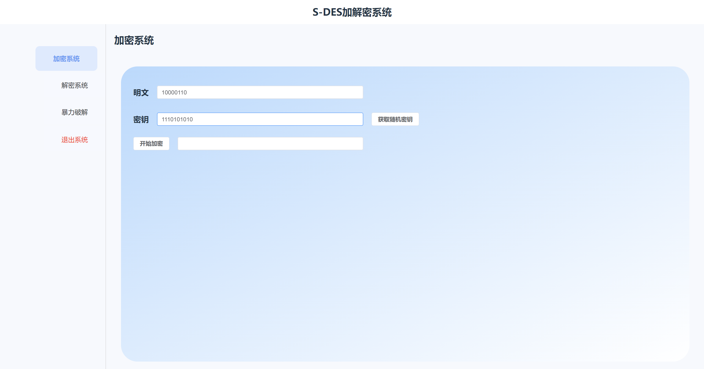

  3. 获取加密结果：

     

- 解密操作：

  1. 输入8bit密文并生成随机密钥：

     

  2. 获取解密结果：

     

### 第2关：交叉测试

- 胡海波老师教学班陈露，罗丹小组的加密结果：

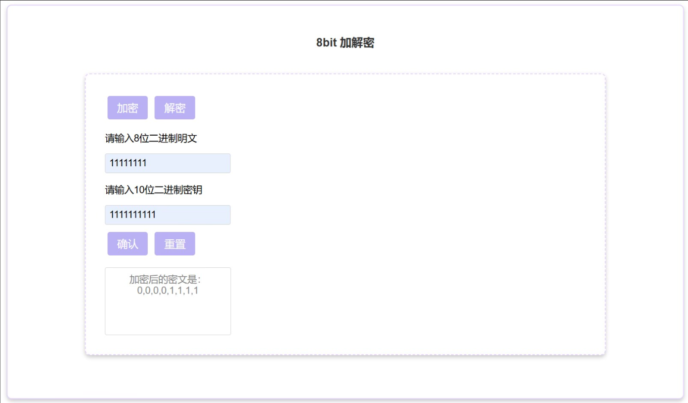

- 我们小组的加密结果：

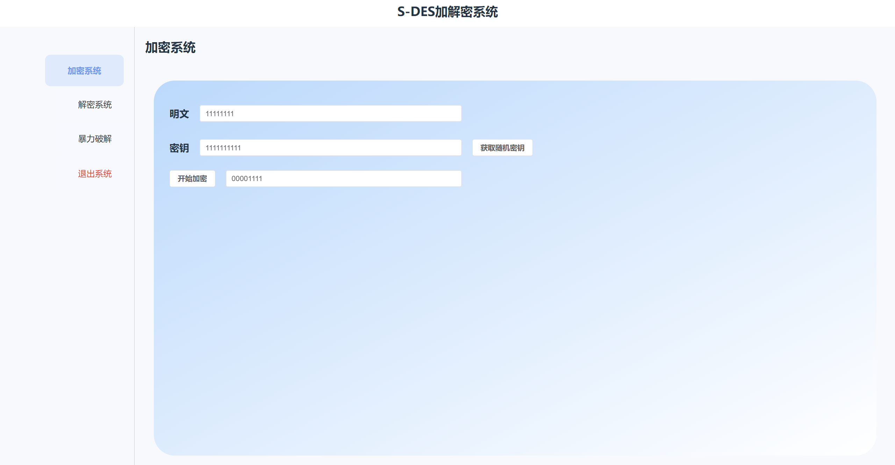

结果一致，表明通过了交叉测试

### 第3关：扩展功能

- 加密功能：

  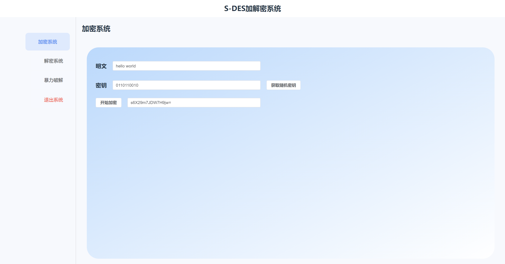

- 解密功能：

  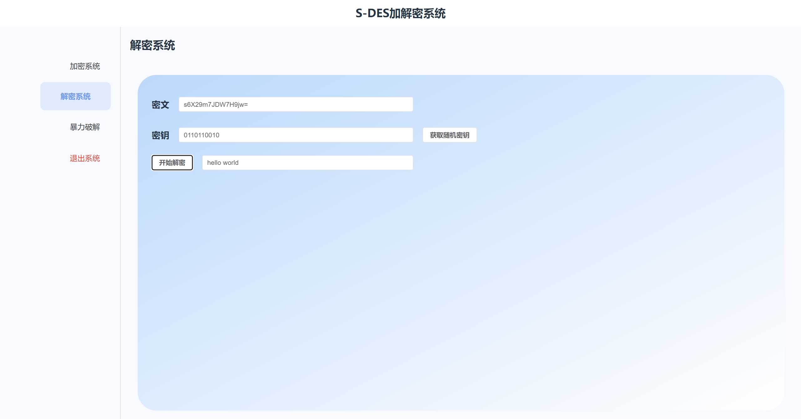

### 第4关：暴力破解

1. 输入明密文对：

   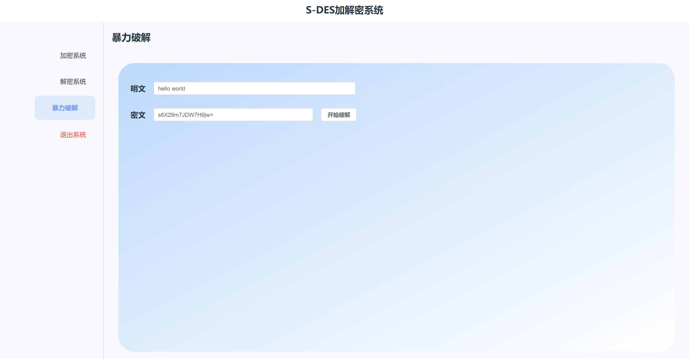

2. 开始破解：

   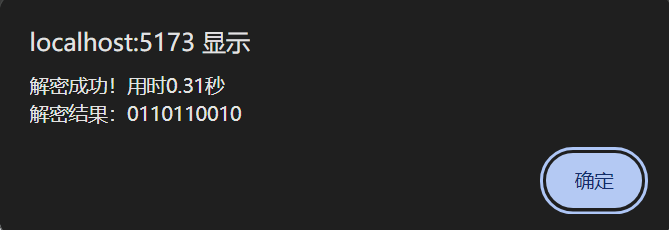

### 第5关：封闭测试

我们的破解函数能够找到一对明密文之间的所有可能的密钥，下面是一个例子：

1. 输入明密文对：

   

2. 获取对应的所有密钥：

   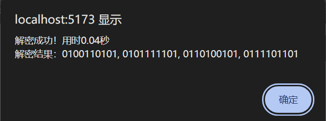

可以发现该明密文对之间有四把不同的密钥

## 相关文档

### 一、引言

1. 文档目的：本用户指南旨在帮助用户了解和使用基于 Flask、HTML、Vue 开发的 S_DES 加密算法应用程序，包括加密明文、解密密文以及在知晓明文密文情况下暴力破解密钥的功能。
2. 适用范围：适用于需要对数据进行加密和解密操作的用户直接使用本程序进行加解密操作，以及对密码学和网络安全感兴趣的技术爱好者提供一定的专业参考。

### 二、产品概述

#### 1、功能简介：

- 加密明文：用户输入的明文,并获取随机的密钥，通过 S_DES 加密算法进行加密，生成密文。

- 解密密文：输入密文以及对应的密钥，通过 S_DES 解密算法还原出明文。

- 暴力破解密钥：在已知明文和密文的情况下，尝试所有可能的密钥组合，以找到正确的密钥，并记录破解时间。

#### 2、系统要求：

- 浏览器：支持现代浏览器，如 Chrome、Firefox、Safari 等。

- 网络连接：需要连接互联网以访问应用程序。

#### 3、安装与配置：

无需安装，用户只需通过浏览器访问应用程序的网址即可使用。

### 三、使用说明

#### 1、界面介绍：

加密页面：包含明文输入框、密钥获取按钮以及显示密钥区域，加密按钮和加密结果显示区域。

> 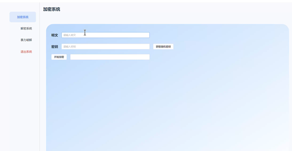
>
> 图1加密页面展示

解密页面：包含密文输入框、密钥输入框、解密按钮和解密结果显示区域。

> 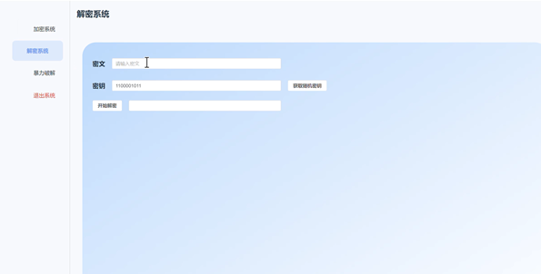
>
> 图2解密页面展示

暴力破解页面：包含明文输入框、密文输入框、开始破解按钮和破解结果显示区域，破解耗时显示区域。

> 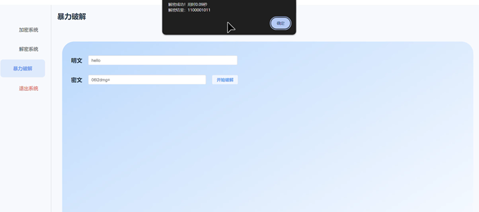
>
> 图3暴力破解页面展示

#### 2、操作流程：

加密明文：

1. 在加密页面的明文输入框中输入要加密的文本。
2. 点击“获取随机密钥”获得加密密钥。
3. 点击“开始加密”按钮，系统将使用 S_DES 加密算法对明文进行加密，并在加密结果显示区域显示密文。

解密密文：

1. 在解密页面的密文输入框中输入要解密的密文。
2. 在密钥输入框中输入正确的密钥。
3. 点击解密按钮，系统将使用解密算法对密文进行解密，并在解密结果显示区域显示明文。

暴力破解密钥：

1. 在暴力破解页面的明文输入框中输入已知的明文。
2. 在密文输入框中输入对应的密文。
3. 点击“开始破解”按钮，系统将开始尝试所有可能的密钥组合，直到找到正确的密钥，并在破解结果显示区域显示密钥。

### 四、维护与更新

本应用程序由开发者进行维护和更新，后续可能会增加新功能，用户可以访问作者github账号，以获取最新版本。

### 五、附录

#### 1、术语表：

- S_DES：对称密钥加密算法，用于对数据进行加密和解密。
- 明文：未加密的文本。
- 密文：经过加密后的文本。
- 密钥：在加密和解密过程中使用的秘密字符串。

#### 2、参考资料：

- 《信息安全导论》
- Flask 官方文档
- Vue 官方文档

## 开发手册

### 一、引言

1. 文档目的：本开 发手册旨在为开发人员提供基于 Flask、HTML、Vue 开发的 S_DES 加密算法应用程序的接口说明，以便他们在开发过程中正确使用这些接口。
2. 适用范围：适用于需要对 S_DES 加密算法进行集成或二次开发的开发人员。

### 二、系统概述

#### 1、架构说明

**S_DES模块：**

- 主要由一系列函数组成，实现了 S-DES 加密算法的各个步骤，包括置换、左移、S 盒替换、生成子密钥、加密、解密以及一些辅助函数。函数之间通过调用关系相互协作，共同完成加密、解密和暴力破解等功能。
- 使用 Python 的内置函数和列表操作实现各种置换和转换操作。利用secrets模块生成随机密钥。通过位操作和异或运算实现加密和解密过程中的关键步骤。

**flaskBlock模块：**

- 该 Flask 应用使用了flask_cors扩展来处理跨域请求。定义了四个路由，分别对应加密、解密、生成随机密钥和暴力破解功能。每个路由通过调用DES模块中的相应函数来实现具体的功能。
- 使用 Flask 的路由装饰器来定义不同的接口路径和请求方法。通过request.json获取 POST 请求中的 JSON 数据。使用jsonify函数返回 JSON 格式的响应。

**前端模块：**

- 使用el-container、el-header、el-main等 Element UI 组件构建页面布局。页面分为左右两部分，左边是功能卡片导航，右边是具体的功能区域。右边的功能区域根据用户选择的卡片显示加密、解密或暴力破解的输入和结果区域。
- 使用 Vue 的响应式数据和模板语法实现界面的动态更新。引入axios进行与后端 Flask 接口的异步通信。利用 Element UI 的组件进行界面的构建和美化。

#### 2、技术选择：

**Flask：**

- Flask 是一个轻量级的 Web 框架，对于小型到中型规模的应用非常适合。对于这个 S-DES 加密算法应用程序，不需要过于复杂庞大的框架，Flask 可以快速搭建起后端服务。允许开发者根据具体需求进行高度定制化开发。可以轻松地集成加密算法相关的功能模块，并且方便进行扩展和修改。

**Vue：** 

- Vue 的组件化开发模式可以提高代码的可维护性和可复用性。对于复杂的前端界面，可以将不同的功能模块拆分成独立的组件，方便开发和管理。可以实现数据的双向绑定，使得页面的数据更新更加自动和高效。开发者只需关注数据的变化，而无需手动操作 DOM 来更新页面。可以根据项目的需求逐步引入 Vue 的功能，对于不同规模的项目都有较好的适应性。

#### 3、加密算法概述：

**特点**

- 相对简单：S-DES 是一种简化的加密算法，其复杂度相对较低，易于理解和实现。
- 对称密钥：加密和解密使用相同的密钥，这意味着密钥的管理在安全性方面具有一定的挑战。
- 块加密：对固定长度的数据块进行加密，通常以 8 位为一个数据块进行处理。

**应用场景**

- 教学和学习：由于其相对简单，常被用于密码学教学中，帮助学生理解加密算法的基本原理。
- 小型应用：在一些对安全性要求不是特别高的小型应用中，可以作为一种简单的加密手段。

### 三、接口列表

#### S_DES模块：

1. `generate_random_key()` ：

   - 功能：生成一个随机的 10 位二进制密钥。
   - 返回值：一个包含 10 个 0 或 1 的列表，表示生成的密钥。

2. `encrypt(plaintext, key)` ：

   - 功能：使用给定的密钥对明文进行加密。

   - 参数：

     - plaintext：要加密的明文字符串。

     - key：加密密钥，一个包含 10 个 0 或 1 的列表。

   - 返回值：加密后的密文的 Base64 编码字符串。

3. `decrypt(ciphertext, key)` ：

   - 功能：使用给定的密钥对密文进行解密。

   - 参数：

     - ciphertext：要解密的密文的 Base64       编码字符串。

     - key：解密密钥，一个包含 10 个 0 或 1 的列表。

   - 返回值：解密后的明文字符串。

4. `brute_force_sdes(plaintext, ciphertext)` ：
   - 功能：在已知明文和密文的情况下，暴力破解 S-DES 密钥。
   
   - 参数：
   
     - plaintext：明文字符串。
   
     - ciphertext：密文的 Base64 编码字符串。
   
   - 返回值：如果找到匹配的密钥，则返回密钥的字符串表示；如果未找到，则返回None。
   
5. `find_all_keys_sdes(plaintext, ciphertext)` ：
- 功能：查找所有能够将给定明文加密为给定密文的密钥。
   
- 参数：
   
  - plaintext：明文字符串。
   
  - ciphertext：密文的 Base64 编码字符串。
   
- 返回值：一个包含所有匹配密钥的字符串表示的列表，如果未找到任何匹配的密钥，则返回一个空列表。

#### flaskBlock模块：

1. `/encrypt` ：
   - 请求方法：POST
   - 功能：对给定的明文进行加密。
2. `/decrypt` ：
   - 请求方法：POST
   - 功能：对给定的密文进行解密。
3. `/getKey` ：
   - 请求方法：POST
   - 功能：生成一个随机的 S-DES 密钥。
4. `/bruteforce` ：
   - 请求方法：POST
   - 功能：在已知明文和密文的情况下，暴力破解 S-DES 密钥。

### 四、接口详细说明

#### 1、S_DES模块：

**generate_random_key()：**

- 内部实现：使用secrets.randbits(10)生成一个随机的 10 位整数，然后将其转换为二进制列表。

- 调用示例：`key = generate_random_key()`

**encrypt(plaintext, key)：**

- 内部实现：

  - 将明文字符串转换为二进制列表。

  - 按 8 位分块对明文进行加密，对不足 8 位的块进行填充。

  - 使用bin_to_base64将加密后的二进制数据转换为 Base64 编码字符串。

- 调用示例：`ciphertext = encrypt("Hello World", [1, 0, 1, 1, 0, 1, 0, 1, 1, 0])`

**decrypt(ciphertext, key)：**

- 内部实现：

  - 将密文的 Base64 编码字符串转换为二进制列表。

  - 按 8 位分块对密文进行解密。

  - 将解密后的二进制数据转换为明文字符串。

- 调用示例：`plaintext = decrypt("ciphertext_base64", [1, 0, 1, 1, 0, 1, 0, 1, 1, 0])`

**brute_force_sdes(plaintext, ciphertext)：**

- 内部实现：

  - 将明文和密文转换为二进制列表。

  - 遍历所有可能的 10 位密钥，对明文进行加密，并与给定密文进行比较。

  - 如果找到匹配的密钥，则返回其字符串表示。

- 调用示例：`found_key = brute_force_sdes("Hello World", "ciphertext_base64")`

**find_all_keys_sdes(plaintext, ciphertext)：**

- 内部实现：与brute_force_sdes类似，但会收集所有匹配的密钥。

- 调用示例：`keys = find_all_keys_sdes("Hello World", "ciphertext_base64")`

#### 2、flaskBlock模块：

**/encrypt：**

- 请求参数：

  - plainText：要加密的明文字符串。

  - secretKey：加密密钥，以字符串形式表示的 10 位二进制数字序列。

- 响应格式：

  - 成功：{"encryptedText": "加密后的密文"}

  - 错误：{"error": "错误信息"}，状态码为 400 或 500。

**/decrypt：**

- 请求参数：

  - cipherText：要解密的密文的 Base64 编码字符串。

  - secretKey：解密密钥，以字符串形式表示的 10 位二进制数字序列。

- 响应格式：

  - 成功：{"decryptedText": "解密后的明文字符串"}

  - 错误：{"error": "错误信息"}，状态码为 400 或 500。

**/getKey：**

- 无请求参数。

- 响应格式：

  - 成功：{"secretKey": "随机生成的 10 位密钥"}

  - 错误：{"error": "错误信息"}，状态码为 500。

**/bruteforce：**

- 请求参数：

  - plaintext：明文字符串。

  - ciphertext：密文的 Base64 编码字符串。

- 响应格式：

  - 成功：{"key": "找到的密钥列表", "time_taken": "破解所用时间（秒）"}

  - 错误：{"error": "未找到匹配的密钥"}，状态码为 404。

### 五、数据格式

#### S_DES模块：

1. 密钥：一个包含 10 个 0 或 1 的列表。
2. 明文和密文：字符串类型。加密后的密文以 Base64 编码字符串形式表示。

#### flaskBlock模块：

1. 请求数据：使用 JSON 格式，参数名称与接口详细说明中的请求参数一致。
2. 响应数据：JSON 格式，具体内容根据接口详细说明中的响应格式确定。

### 六、错误处理

#### S_DES模块：

1. 如果明文和密文的块数不一致，brute_force_sdes和find_all_keys_sdes会打印错误信息并返回相应的默认值（None或空列表）。
2. 如果在加密或解密过程中出现其他异常情况，目前代码中没有明确的错误处理机制。开发人员可以根据实际需求添加适当的错误处理代码

#### flaskBlock模块：

1. 对于缺少必要参数的请求，返回状态码     400 和相应的错误信息。
2. 对于加密、解密或生成密钥过程中出现的异常，返回状态码 500 和错误信息。
3. 如果暴力破解未找到匹配的密钥，返回状态码 404 和相应的错误信息。

#### 前端模块：

1. 在加密、解密和暴力破解函数中，首先检查用户输入是否为空，如果为空则弹出提示框并返回。
2. 如果与后端接口通信出现错误，在控制台打印错误信息，并弹出提示框告知用户操作失败。

### 七、安全考虑

1. S-DES 是一种相对简单的加密算法，安全性有限。不建议在对安全性要求较高的场景中单独使用。
2. 随机密钥的生成使用了secrets模块，增加了密钥的随机性，但仍然不能保证绝对的安全性。
3. 在使用暴力破解功能时，应注意其计算复杂度可能较高，尤其是对于较长的明文和密文。
4. 虽然使用了加密算法，但在实际应用中，应注意保护密钥的安全，避免在网络传输中泄露。
5. 对于暴力破解功能，应考虑限制其使用频率，以防止恶意攻击。
6. 对于敏感数据的传输，应确保后端使用安全的通信协议（如 HTTPS）。

### 八、性能优化

1. 可以考虑使用更高效的算法或数据结构来实现置换、S 盒替换等操作，以提高加密和解密的速度。
2. 对于暴力破解功能，可以考虑使用更优化的搜索算法，以减少破解时间。

### 九、附录

#### 1、术语表：

- S-DES：简化数据加密标准，一种对称密钥加密算法

- 置换：对数据进行重新排列的操作

- 左移：将二进制数据向左移动一定位数的操作

- S 盒替换：使用 S 盒（查找表）对数据进行替换的操作

- 密钥：用于加密和解密数据的秘密值

- 明文：未加密的数据

- 密文：加密后的数据

- Base64 编码：一种将二进制数据转换为可打印字符的编码方式

- Flask：一个使用 Python 编写的轻量级 Web 应用框架

- CORS：跨源资源共享，用于处理不同源之间的 HTTP 请求。

- Vue：一个用于构建用户界面的渐进式 JavaScript 框架

- Element UI：一套基于 Vue 的 UI 组件库

- axios：一个基于 Promise 的 HTTP 客户端，用于浏览器和 Node.js

#### 2、参考资料：

- 《信息安全导论》

- Python 官方文档

- Vue 官方文档。

- Element UI 官方文档

- axios 官方文档

- Flask 官方文档

- flask_cors官方文档